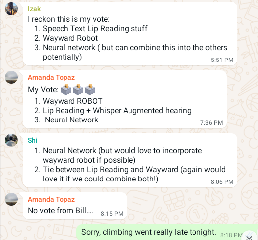
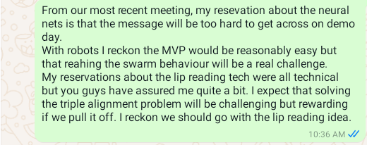

# Initial discussion of ideas
first we quickly ran through everything on our [list of ideas](Group_Build_Design_Criteria.md) to establish which of the ideas we were still keen on. if two of us were keen on the idea we put it on the short list.
 - Blood idea
 - Personal Language Model
 - Sign Language Interface
 - Hippocampus Filing System
 - Ento Meteorology
    - Use existing footage of ants?  Is kidnapping ants unethical?  Could be wrecked if it doesn't rain
 - Waving Tube Man Tube man mimic / waving tube man
    - Tricky engineering problem. Chaos is unpredictable and predictable.
 - Wayward Robot Refuge		

# Discussion of the short list 
Based on quickly running through the long list of ideas We decided that the short list was:
1. The DIY Neural Network Kit
2. The lip Reading Hearing Aid
3. The Wayward Robot refuge

## DIY Neural Network Kit 		
Bill likes this the best. Microcontroller kit.  3 or 4 stations - tensor flow playground vs one station unlearning your ontology. We are building physical neural network made of microcontrollers. 
Beyond that we are building an educational kit.  What are the sensors and actuators?  Solve a real world problem.  

# Our thoughts on the short list
We went around the circle taking turns to give our opinions on the three projects on the short list. We each said something good and something bad or scary about each of the ideas the thoughts are noted below.

## Shi's Notes

### Bill
 1.  **Neural Net** - Passionate about the philosophy - may be difficult to demonstrate
 2.  **Speech to text** - because it's a wearable it may be limited.  Risky MVP - Advantage - clear positive message
 3.  **Wayward Robot** - easy to demonstrate MVP within reach. Downside is the message.  What is the message? 

### Amanda
 1.	I love the idea of learning something new.  Risky MVP 
 2.	Visual.  Good message.  Doable?
 3.	**Wayward Robot** fun/alluring, but message?
 
### Shi
 1.	**Neural net**'s educational aspect very cool  Struggling to understand the complexity.  The messaging will need to be crafted well.  Could integrate the wayward robot.
 2. **Speech to text** - good story singular message.  Worry about demo day:  One person interacting with the piece.  Possibly awkward.
 3. **Wayward Robot** - combine the two could be good.  Within Grasp.  The message is a bit vague.

### Izak
 1. **Neural Net** - Several different kinds.  Kits.  This is good.  A perceptron is easier to digest.  Different types of perceptron.  Can combine with wayward robots.  Older demographic may not want to engage with it. Have a fear that the audience will be an older audience.  They may know about neural networks.  We need to decide an audience.
 2. **Speech to text** - very feasible.  You could have a wearable and a random.  Maybe one screen that combines random person - regardless of what you are doing it is a spyware.   People are engaged in the room, even though they are not engaged with any of us personally.
 3. **Wayward Robot** - People can watch the chaos or non-chaos play out.  Referencing swarm science is really cool.  I reckon the message is about emergence from interactions amongst diverse actors.  The message is about emergence from interactions amongst diverse actors.

## Bill's notes
1. Neural Nets
    - B- worried it is too hard to explain
    - B I'm passionate about the philosophy
    - A I like that I will learn
    - S could integrate the wayward robot refuge.
    - S- The message seems harder to get across in a short time
    - I+ can be done a few different ways and can 
    - I- Older demographic might not want to play with it. 
2. Speech to text
    - B+ I like that it is a clear positive message
    - A- Risky MVP
    - B- demo day too linear
    - S+ message is good
    - S- the demo day might be too crowded
    - I+ I reckon it is very feasible
    - I+ we can have a non-wearable part
    - I- it can also be used as a surveilance tool
3. Wayward robots
    - B Relatively easy MVP
    - A Alluring
    - S- The message is a bit vague
    - I+ swarm science is really cool
    - I+ I reckon the message is about emergence from interactions amongst diverse actors
  
# Voting

# Outcome

We decided to go with the **Speech to Text** idea. We scheduled another meeting on the 1st of August to confirm that we were all happy with the decision.  
