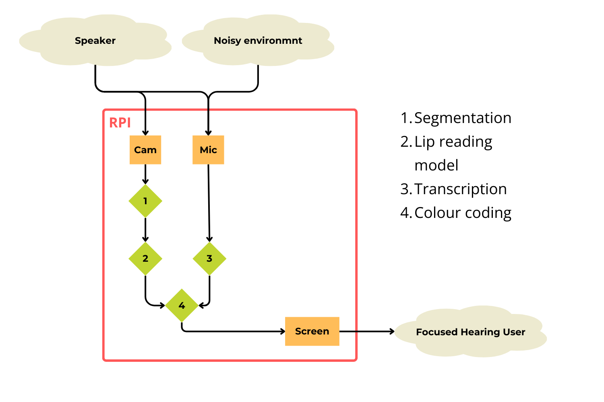
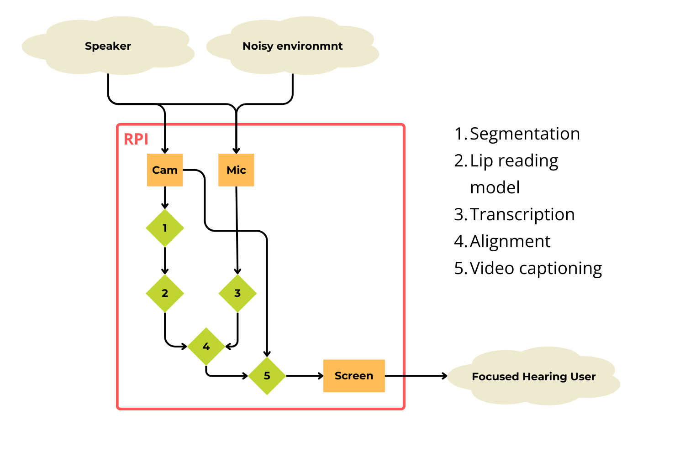
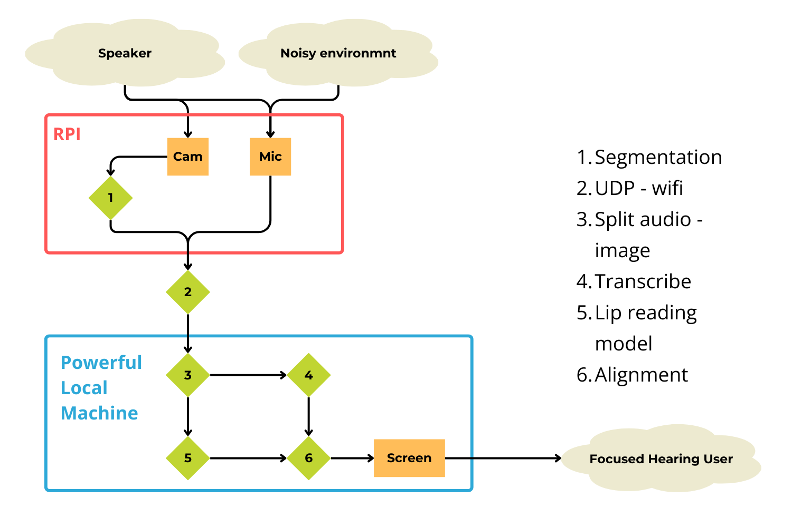
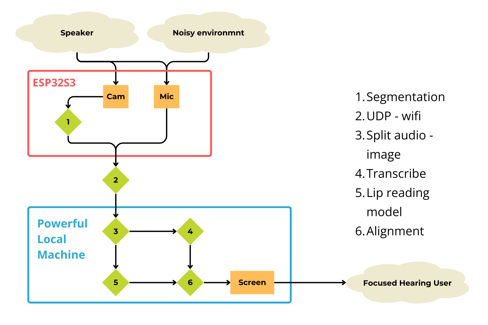
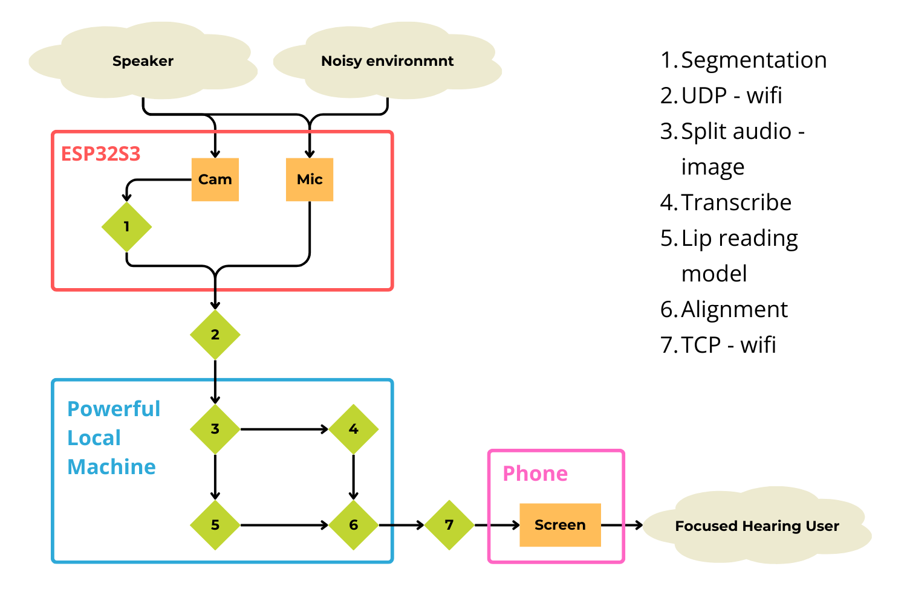
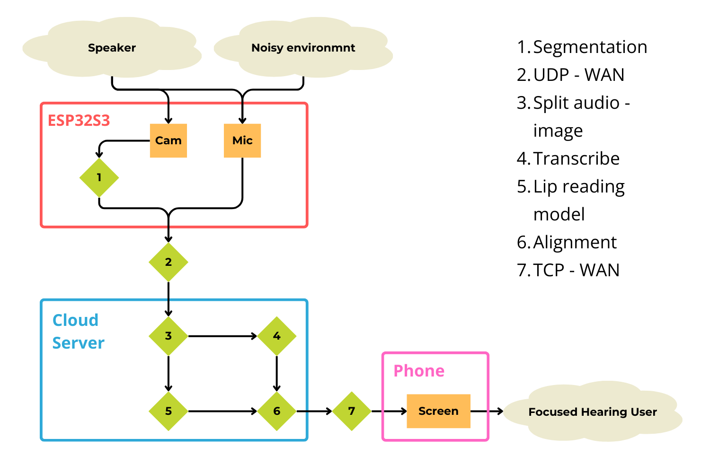

# Proposed Architecture - Focused Hearing

## Minimum Viable Product

This is the minimum viable product (MVP) for focused hearing. It shows that each of the component technologies exist and work. In this version the technologies have only barely been brought together. 

 - Try to get the sensors feeding data to the two separate AI models.
 - All running on the Raspberry Pi (RPI)
 - It will probably be too slow to live transcribe and display
 - We won't try to do the alignment for the MVP
 - The device isn't useful because it is slow and isn't portable.

## Minimum Viable Product +1

This extends the MVP by adding the alignment model so that data from both of the two AI models can be brought together. It also makes it a bit more impressive by showing the output as colour coded captions on the original video.

 - Even slower than MVP because there is an extra model competing for the PI's resources.
 - marginally more impressive for demo day althtough the extra slowness might cancel this out.
 - The device isn't useful because it is slow and isn't portable.

## Fast transcript

Having got everything running on one device, we start to send data over the network so that we can use a more powerful machine to process everything which makes the transcript fast.

 - The main job here is to get the communications to work over wifi
 - The device still isn't useful because it isn't portable but now it is fast.

## Miniature sensor

Here we replace the Raspberry Pi as our sensor. The [ESP32S3](https://www.seeedstudio.com/XIAO-ESP32S3-Sense-p-5639.html) is wearable-sized and has a camera, a microphone and wifi. It should be able to serve the video stream to a more powerful computer. It has inbuilt AI models so it should still be able to crop the image to a face. 

 - The main work for this step is spent in the Arduino development environment trying to get it to send a stream of video to a machine on the same wifi network 
 - Having got the communications working we would spend some time designing a nice wearable enclosure with batteries
 - The device still isn't portable because the transcript shows on a big screen on the processing device.

## Three local devices

Now we make the system genuinely portable. The end-user interface is moved to a phone. The phone shows the live transcript as it is output by a powerful machine on the same wifi network.

 - We build a web server on the processing machine that outputs a simple little page that just shows the text stream and reloads as updates come through.
 - Anyone on the wifi can connect to this website from any device (including phones) to read the text stream. They'd access a web address like focused-hearing.local from their web browser.
 - The device is now portable. But we're relying on a powerful computer connected to the local network and loaded with specialist software. That means it only works in your home/office.

## Released 
This is the final stretch goal. It makes focused hearing something that anyone hard-of-hearing could carry around and use anywhere that there is internet.

 - We set up an AWS server that can run all the AI models and which serves the webpage with the transcript.
 - The edge device will send the video stream straight to the remote server. The protocols should be much the same as they were for the local device but now we will have to deal with the ANU's firewall. 
 - Anyone in the world can look up the webpage to read the transcript in real time.
 - This demo version lacks proper security which would be the next step.

