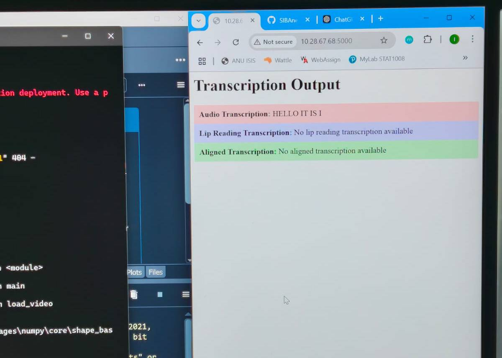
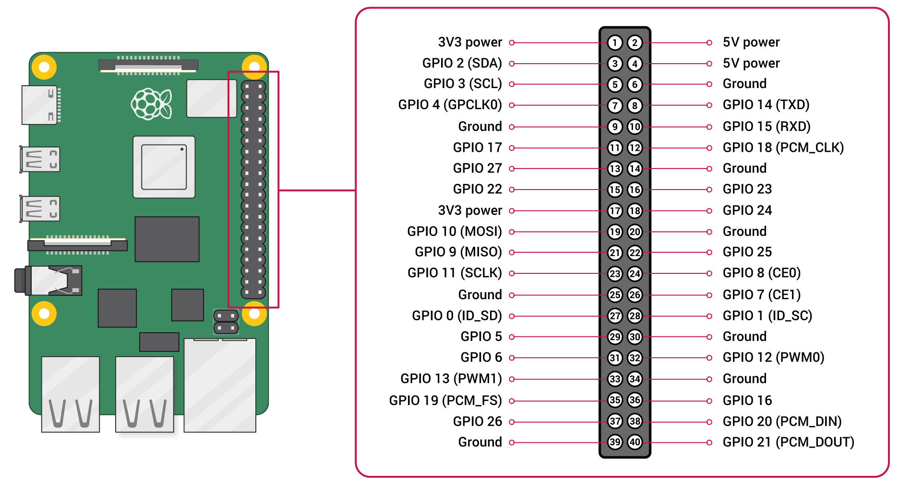

# Focused Hearing Prototype Documentation

# Makers 

> Clearly list and credit all individuals involved in the creation of the prototype.

Focused Hearing was made by:

 - Shi Pui Ng
 - Izak Lindsay
 - Bill McAlister
 - Amanda Topaz


# Objective of prototype 

> Define the purpose and goals of your prototype. Outline what you aim to achieve with its development.

Focused Hearing is an alternative to AI-assisted hearing aids. Speech recognition in a noisy environment can be challenging. Rather than trusting an algorithm to decide what constitutes background noise, the user can focus on the mouth of the speaker they wish to hear, and through cross modal fusion <ref> of a lip reading and speech recognition model, be given the data they need. In our view this leverages our natural habit of looking at the person that we want to hear rather than conceding agency to an AI to decide what is noise.

**Focused Hearing Objective:** Enable hearing impaired people to communicate naturally in noisy environments.
    
**Prototype Objective:** Demonstrate the viability of the technologies that underpin focused hearing by producing a minimally functional version.
    
# List of (desired/fulfilled) functions

> Specify both desired and fulfilled functions of the prototype. Detail how each function is implemented, including sensing, actuation, computation, and machine learning.

## Fulfilled Functions

### Prouce Transcripts from Audio 

**Function:** Produce transcripts from audio recordings of speech.

Speakers produce transcripts from audio. Speakers are recorded through the microphone in the Prototype device. This is the sensing component of Focused Hearing. Speech-to-text is a well-researched problem in machine learning. There are many off-the-shelf models available that can transcribe speech into text in real-time. This function sits mid-way along the computational pipeline of Focused Hearing. It does not interface directly with sensors or actuators but instead takes abstract data in one form and transforms it to another form. 

In the prototype, computation of this speech-to-text component is performed by a remote server. Audio data is sent over the internet to Google servers to produce the transcript.

### Compare Transcripts 

**Function:** Compare transcripts originating from different data sources to infer whether the incoming message is background noise or not.

Comparison of transcripts is achieved with conventional algorithms and does not require any machine learning. This function is also deep in the computation pipeline of Focused Hearing. Abstract data has been collected by the Raspberry Pi's camera and the Raspberry Pi's microphone and transformed by machine learning algorithms before being synthesised by the alignment algorithm.

In practice, the alignments resulting from this model are nearly always poor quality but this is due to the limitations of the lip reading model as discussed below. Effectively, this function was fulfilled for words within the vocabulary of the lip-reading model. However, because the limiting factor is limitations in the lip-reading model, e've put it down as a fulfilled function. 

See the section on the Needleman-Monch algorithm below for more details about how this function was implemented.

### Display Transcripts 

**Function:** Display transcripts to the user in a way that helps them understand their speaking partner.

we successfully implemented this function. Using [Python's Flask library](https://pypi.org/project/Flask/), we established a web server that effectively displays transcripts to the user in a way that is easily interpretable. In real time, the server updates a web page to display transcripts from the lip-reading model, the audio transcription model and the alignment algorithm. This web page can be thought of as the actuation component of Focused Hearing, where a screen displays information that the hearing-impaired individual would not have been able to glean from their environment.



## Partly Fulfilled Functions

### Lip-Reading Transcripts

**Function:** Transcribe English text from silent video data of a person speaking.

Using a custom neural network that we trained on publicly available data, we successfully created a model that can transcribe English by lip-reading. However, there are serious limitations to the model that we created. It only understands words from its training dataset, which was very restricted. It is also poor at recognising when a speaker is not speaking. Because it is very computationally intensive, it could not be implemented in real-time. The lip-reading model was part of the computational elements, it was midway down the pipeline of information flow in focused hearing.

For more information about this function, see the 'Lip-Reading Model' section under 'Software Components'. Also, see the 'Challenges and Solutions' section below. 

### Transcribe speakers in real time.

**Function:** Video and audio transcriptions are both instantaneous so that a user can get transcripts of their speaking partner while interacting.

This function was partly fulfilled. It was easy to get the audio transcription fast enough to be real-time, but it was not possible to get the lip-reading transcripts to generate in real-time. This is because of how computationally intensive lip-reading is. It requires neural network inferences to be run on time series in two dimensions. Before it can be run, these coordinates need to be extracted from images. Because of this limitation, the design of focused hearing for the prototype had to be altered in such a way as to demonstrate how the technology works, but only use short messages and have a delay between recording and display of the final transcript.

### Wearable

**Function:** Make the device wearable on the head so that the direction of gaze naturally controls the information drawn from the environment.

In producing this prototype we've had a chance to experiment with making wearable tech. To be wearable, the device must be small and incospicuous. A very important factor in reducing the size of the device is power consumption. DEvices that consume a lot of power require large batteries. 

The prototype device is built with a raspberry pi which is a pocket-sized circuit board. As demonstrated by our VR headset enclosure, it is possible to wear a Raspberry Pi on the head. The Requires 15W of power to reliably run. This means only substantial powerbank batteries were adequate to power it for the 3 hour duration of Demo Day. With its sizable form factor and large battery the Focused Hearing prototype was undeniably conspicuous when worn on the head.

## Desired Functions

### Audio Manipulation 

**Function:** Use the aligned message to suppress background noise in an audio feed sent to the user's earing aids or noise canceling headphones.

The ultimate goal of focused hearing is to return agency to users of modern hearing aids. In order to replace the main function of hearing aids, the output of focused hearing needs to be a manipulated audio stream. It was clear to us from the outset that this function would be beyond our capacity to fulfill within the time frame of taking information from the alignment algorithm about which of the speakers is being looked at by the hearing-impaired individual, and then using that to manipulate the sounds greatly increases the complexity of the architecture of focused hearing.
An audio segmentation component, which is not currently part of the design, would need to be brought in. It would also need to be a new actuator in the form of noise cancelling Bluetooth earbuds or hearing aids. Because of the immense increase in components required to implement this function, we decided not to do it.
We felt that the minimum viable product, displaying text transcripts to the user, still fulfilled our objective of allowing hearing-impaired individuals to interact naturally. However, it is clear that to fulfill this objective to the greatest degree and in the most contexts, it would be necessary to add an audio manipulation function to focused hearing.

# Prototype Architecture

As shown in the figure below, focused hearing broadly consists of four parts. First, there are the physical components that the user interacts with on the recording device. Then there's the cyber components of the recording device. The recording device then sends a message to a server, which is another cyber component, and, the fouth part, the server then displays the results back to the user via a website. 

Machine learning was employed for two elements of the device. A pre-trained model was used for converting input audio into text. A custom model was trained in order to convert video of lips into text. A custom algorithm was also developed for the purpose of aligning information from the two transcription models. 

The objective of focused hearing is to allow hearing impaired individuals to communicate naturally in noisy environments. Whereas data from the audio input is jumbled with background noise, possibly including many other speakers who are not the speaking partner of the hearing impaired individual, the lip reading model only takes information from the face that is most central to the viewer's gaze. Because of this, the lip reading model outputs only information which is of interest to the hearing impaired individual. However, focused hearing takes the approach of trying to combine information from the audio model with the lip reading model. This is so that any information that is missed by the audio model will nevertheless be able to be combined with the information that is coming through from the lip reading model. 

The ultimate objective for natural interaction would be for focused hearing to be capable of segmenting audio and amplifying only the speaking partner of the hearing impaired individual over the background noise. However, this was not achievable with the resources that we had for this project. We decided for this reason to output transcriptions of the information rather than audio. The transcripts are generated and posted to a live updating website. Done in this way, it is possible for a hearing impaired person to access the website and view it on their mobile phone while they are communicating.

The section below will describe in more detail the software components of focused hearing, the physical components of focused hearing, and how each of these were made and the tools and materials that were used to produce them.


## Software Components

Focused Hearing comprises 
Below is a diagram illustrating the relationship between the different software components that comprise Focused Hearing. 
    
### Lip Reading Model

The lip reading model is a custom neural network that was developed from LipCoordNet. The model was trained on the GridCorpus dataset and as its input the lip reading model takes mp4 video files.
It ignores the audio component of the video files and splits the visual component down into frames. In each frame it then assigns coordinates to different landmarks of the face. By tracking changes in the coordinates of the landmarks it can make inferences about what has been said. [LipCoordNet](https://huggingface.co/SilentSpeak/LipCoordNet) is a neural network that has been optimized for working with this type of coordinate-through-time data for lip reading. 

The model outputs a transcript in English text. There was discussion of using phonetic text as the output for this model however it was decided to use English text as the output because training data was more readily available. 

The training of the lip-reading model was somewhat intensive and required significant time on a GPU. To generate inferences from the model also requires a GPU because it's very computationally intensive. The [CUDA library in Python](https://pypi.org/project/cuda-python/) is used to allocate GPU resources to the execution of this model. The speed with which inferences can be generated from this model is one of the limitations of making focused hearing live. The need for a GPU means that this model cannot be deployed on small scale computation devices it is inevitably going to be power hungry. Audio to text model was relatively easy to implement.

Another limitation of this model is the availability of quality training data. The [Grid Corpus dataset](https://spandh.dcs.shef.ac.uk/gridcorpus/) is very high quality training data however it only includes British English speakers and comprises perhaps only 100 words. The vocabulary of the Grid Corpus dataset is shown below. The Lip-reading model that underpins Focused Hearing was trained only on this data and so does not reliably recognise other words. Because of this, the lip reading model that we developed for the focused hearing project is not very good at recognizing words that are not in its training dataset. As all the training data includes people speaking without long pauses, the model is not very good at recognizing when a person is not speaking. 

   

### Audio to Text Model

The audio to text model also required machine learning. However, unlike lip reading, speech to text has received a lot of interest and effort on development from the machine learning industry and so speech to text is in a much more mature state of development. As such, there were many off-the-shelf solutions available for us to translate spoken audio data into English text.
[OpenAI's whisper model](https://github.com/openai/whisper) is one of the more recognized and mature solutions available. Many of the models available can be accessed as APIs. This way the computation, the inference from the model is calculated by a remote server.
This was the approach taken for focused hearing. Audio data recorded on our device is posted to Google's speech to text API interface. This process can be executed remarkably quickly and speech to text inference can be transcribed live while the speaker is talking in this way.

### Alignment Algorithm

The alignment model is a customised [Needleman-Wunsch algoritm](https://en.wikipedia.org/wiki/Needleman%E2%80%93Wunsch_algorithm). The Needleman-Wunsch algorithm was originally developed for the sequencing of DNA in the 1970s. At the time it was a cutting-edge application of what is termed [dynamic programming](https://en.wikipedia.org/wiki/Dynamic_programming).

For the purpose of focused hearing, the alignment algorithm is used to decide whether or not the two transcripts generated by the lip reading model, and the audio to text model, respectively are significantly similar. Inevitably, there will be differences between the two transcripts. This could result from background noise but it could also result from innate differences in the training data sets of the two machine learning models. For this reason it is unrealistic to assume that the two machine learning models will produce identical transcripts when given the same data. 

One consideration in the development of the alignment algorithm was how to assign penalties for differences between letters in the English alphabet. When applied to DNA sequencing the Needleman-Wunsch algorithm traditionally assigns penalties for differences in the sequence proportional to the probability of a mutation causing those differences. When ideally in applying the Needleman-Wunsch algorithm to this problem in focused hearing penalties should be proportional to the phonetic difference between sounds. To implement this would mean that a very small penalty would be assigned for a difference between the letter B and the letter V for example whereas a line between the letter L and the letter A for example. However as both of the machine learning models that feed data to the alignment algorithm give whole sentences as their outputs, the use of English letters as the basis of the alignment is an imperfect solution. As alluded to above, the ideal solution would be to use the phonetic alphabet as the output of both the lip reading model and the audio to text model. This way the Needleman-Wunsch algorithm could assign penalties between different phonetic sounds based on how similar they sound and how similar the lip movements that make them are. The output of the alignment algorithm would thus be a phonetic transcript. However, this would then need to be translated into English for display to the user.

For the short transcripts generated by focused hearing the Needleman-Wunsch algorithm is not computationally intensive. It can be run on a relatively light device in real time.

### Recording Software

The focused hearing prototype has custom recording software that allows it to collect the data necessary as input for the machine learning models of focused hearing. The recording software interfaces with peripheral devices on the Raspberry Pi namely the Raspberry Pi's camera module and a USB microphone. The recording software outputs an MP4 video file and a WAV audio file.

This software is also responsible for interfacing with the user. Recording is started when the user presses the button on the focused hearing controller and LEDs are used to indicate the status of the recording. Once the device has generated a recording, communication software is used to send the data from the focused hearing device to the focused hearing server.

### Communication Software

#### SMB Daemon

[Samba](https://www.samba.org/), an open-source SMB daemon was installed on the Raspberry Pi prototype device. This allowed the server to directly access files that had been saved to the device's hard drive. This is how the MP4 and WAV files generated by the recording software were transferred to the server.

Samba is an easy to implement, off-the-shelf solution that did not require any custom code on our part. However, it does impose the limitation of having a file written to hard drive. In order to make focused hearing live stream transcripts as they are generated, it may be necessary to replace this SMB protocol with something deliberately designed for live streaming rather than file transfer.

#### Socket communications

Custom [network socket](https://en.wikipedia.org/wiki/Network_socket) software was also used for event communication. Each time the prototype device completes the recording of a message it posts a message to a port of the server machine. This is what triggers the server machine to load files through the SMB protocol. This function was implemented by Python code that was setup to run on both the server and the prototype device using the [socket library](https://pypi.org/project/sockets/). 

#### VPN

It was also necessary to establish a [Virtual Private Network](https://en.wikipedia.org/wiki/Virtual_private_network) (VPN) amongst the devices as the ANU WiFi network has a restrictive firewall that blocks SMB and socket communication. The [Tailscale](https://tailscale.com)  helps to easily establish a VPN amongst multiple devices. It was installed on the Raspberry Pi and the Server. This was an off-the-shelf solution that did not require any coding on our part.

#### Flask Website Host

The results of focused hearing are displayed back to the user through a custom web host. The web host is developed using the Flask library in Python. The web host is designed in such a way that any time updates are made to the transcripts these will be automatically detected and instantly displayed to the user.
The web host also displays an animation of the imagery captured and used for the lip reading inference.

## Physical components, materials and tools

> Offer a breakdown of the physical components used in your prototype, elucidating their roles and interactions.

### Focussed Hearing Prototype Device 

The prototype device is a Raspberry Pi computer inside an enclosure made from a second hand pair of VR goggles. We obtained the VR goggles from a trash and treasure market and modified them in such a way that they are no longer useful as VR goggles but that they can enclose a Raspberry Pi, a camera, a microphone and a large power bank to supply power to the Raspberry Pi.

VR goggles were chosen for the enclosure because they represent the idea of a focused hearings user being able to choose who they would like to listen to with the orientation of their gaze and they are sufficiently spacious to accommodate a Raspberry Pi and a power bank that could maintain it for the duration of our exhibit. 

The VR headset that we used was designed to fit a mobile phone and for the mobile phone's camera to be able to peer out of a hatch in the front of the goggles. We modified the goggles so that this hatch was closed over except for a small hole into which we inserted the Raspberry Pi's camera. We then fastened the Raspberry Pi into the void where the mobile phone was intended to go. The USB microphone was plugged into the USB of the Raspberry Pi and allowed to extend just outside the enclosure. For the purpose of showing the device on demo day we mounted it on a clay bust of one of our classmates Mohamed Dosani. The bust had been produced for a previous project.

This device also includes a small and simple physical interface to the user. The interface consists of three different colored LEDs and a small button and a 3D printed enclosure for the interface. The design for the enclosure is available as a CAD model at the following link. The physical interface is connected to the prototype device by a hidden wire that plugs directly to the GPIO pins of the Raspberry Pi.

**Tools and materials used:**

 - A VR headset
 - Hot glue gun
 - Spray paint
 - Vibrating saw
 - 3D printer
 - Breadboards
 - Hot-pluggable wires
 - LEDs
 - A button
 - A USB microphone
 - Plywood
 - Raspberry Pi
 - Camera
 - USB mic

### Wiring

Below is the code used to Initialise the GPIO pins.  

```python
# GPIO setups
BUTTON_PIN = 2
GPIO.setmode(GPIO.BCM)
GPIO.setwarnings(False)
GPIO.setup(BUTTON_PIN, GPIO.IN)
GPIO.setup(18, GPIO.OUT)  # Rec LED
GPIO.setup(23, GPIO.OUT)  # Active LED
GPIO.setup(22, GPIO.OUT)  # Process LED
```

GPIO 2 is used as an input and is wired to the button. The other terminal of the button is wired to a ground pin. GPIO 18 outputs current to the red LED to indicate that recording is underway. GPIO 23 outputs current to the Green LED to indicate that the recording software is active and that button pushes will be acknowledged. Finally, GPIO 22 outputs current to a blue LED to indicate that the server is currently processing the most recent recording. The negative terminal of each of the LEDs is wired to a ground pin via a 220K ohm resistor. The diagram below shows where each of the above input and output pins is located on the Raspberry Pi 4B. Note that GPIO 18 is located on pin 12, GPIO 22 on pin 15 etc.

 

This photo shows the wiring scheme of the prototype device.

 We need a couple of photos of the inside of the device
> (@Bill) We need a couple of photos of the inside of the device.

### Focussed Hearing Server 

Focused hearing requires a server, a powerful computer that interacts with the prototype device to do the bulk of the computation including inference from the custom neural net that we developed. For the purpose of this we used Izak Lindsay's laptop which has workstation specifications including a powerful graphical processing unit (GPU). Izak's computer is installed with the latest version of Windows 11. We did not have to do any physical modifications of the laptop only deploy custom software. 

### Display device

The device that displayed output from our Focused Hearing prototype was a laptop. It was able to access the website interface by joining the same Tailscale network and visiting the server's IP address in a web browser. The laptop was connected to the ANU Secure WiFi network.    

### Wifi

Another important physical element of focused hearing is network infrastructure. The device would not work without wireless communication between the server and the prototype. For the purpose of our exhibit we were able to leverage ANU's existing Wi-Fi network and so did not have to set up our own Wi-Fi infrastructure. However, we did need to set-up a VPN. See the VPN section in above to learn more. The Wi-Fi network did not require any physical build by us but it was an importnat physical element of our device.

# Process of making the prototype 

> Provide an overview of the development process, highlighting key milestones, challenges faced, and solutions implemented.

## Milestones

There were three major milestones in the development of Focused Hearing. Loosely ordered, those milestones were:
 1. Core software complete
 2. Raspberry Pi collects data for server to process
 3. Physical devices built

Development of the core software (the machine learning models and the alignment algorithm) was undertaken as a first step. Once the core software was working, the functions were split across two different devices. A Pi was set up to collect the data and send it to the server. Finally, Having all the software that was needed, we worked to enclose the prototype device into a VR headset.

## Challenges and Solutions

### Lip reading model doesn't perform well on unseen data

We didn't expect that the lip-reading model would perform well with words outside its vocabulary. Nevertheless this was a limitation of the final product. The training data used was quie uniform and restricted to a very small vocabulary. When testing the performance of the lip-reading model, it was clear that it rarely recognises words that were not in its training dataset. We didn't have the resources to make a more sophisticated lip-reading model so our solution to this was simply to encourage users on Demo Day to try using words from the model's vocabulary as part of testing the performance of the device.  

### Raspberry Pi can't run the Lip Reading Model

[One of our initial ideas](https://github.com/bill-mca/SIBAnetics/blob/docs/docs/proposed_architecture.md#minimum-viable-product) for a minimal viable product was to use a Raspberry Pi to do all of the computation for Focussed Hearing. This would've saved the effort of establishing communication software and learning about networking protocols. The lip reading model requires a GPU to execute quickly and it became apparent during our initial tests that the Raspberry Pi's light CPU would take hours to make a lip-reading inference of a 5 second video clip. We tackled this challenge by establishing a client-server architecture [which was originally intended to be a stretch architecture](https://github.com/bill-mca/SIBAnetics/blob/docs/docs/proposed_architecture.md#fast-transcript) that we would build after reaching the MVP.

### Lip-reading model too intensive to run inferences in real time

Even on a powerful computer with a sizeable GPU, processing a 3-second video with the lip-reading model takes a little bit more than 3 seconds. Because of this it was not possible to transcribe speakers on-the-fly as was originally intended. We discussed several possible solutions to this problem including more parralelisation, creating a processing backlogor even hiring a cloud server so that we would have even more computing power! However, time was our most stringent limitation and it was hard to say how much of our development time would need to be invested to accomplish each of the aforementioned solutions. Our chosen solution, which was the safest option given the circumstances, was to drop live transcription as a goal for Demo Day.

# Step-by-step interaction guide 

> Present a step-by-step description guiding users on how to interact with the prototype. This should encompass various modes of engagement and highlight the user experience.

> (@Bill) Getting some stills to include in the document would be good.

### Step 1: Sit and look into the camera

The prototype device is set up on a desk with a chair in front. Sit down at the chair and look directly towards the headset mounted on the bust. This is important so that the camera is trained on your lips and you are within earshot of the microphone.

### Step 2: Push the button

In front of you on the desk there's a small button which will activate the device. You push the button briefly and the red light should come on to indicate that a recording is being made. 

### Step 3: Say a message

The next step is to say a message into the microphone while looking directly into the eyes of the bust.
It is recommended that you use words from the training data set for the lip-reading model. This way there should be good congruence between the two messages that are transcribed by the two machine-learning models.

### Step 4: Wait for the message to be transcribed

The red LED will turn off after 3 seconds. Your recording is finished and the blue light should come on to indicate that the message is now being processed. You may have to wait several seconds before the message will be displayed. 

### Step 5: Read the transcriptions

Once the message has finished being processed the blue light will turn off and you'll see the message displayed on the screen behind you. There should be three messages, one in yellow that indicates what was aligned from both the lip reading and the audio transcript and the other two showing each of the transcripts from the lip-reading and speech-to-text models.

Read the transcripts and see how accurate they are. Which is better? Ask yourself whether the lip reading model has transcribed less of the background noise than the audio transcript?

### Step 6: Repeat and play around

You're welcome to repeat the process several times and try different types of messages. You might try looking away from the camera or covering your mouth. You could have a friend stand off-camera and speak loudly to test if the lip-reading model acurately dicriminates. You might try using exclusively words from the training data set or some words that are similar to words in the training data set.

# References

> cite any external sources, references, or inspirations that contributed to the development of your prototype.

 - Grid corpus dataset
 - Cross-modal fusion
 - 
 - I'll build this with Zotero. I'll include all the hyperlinks as citations

# Acknowledgment

> Express gratitude and acknowledgment to individuals, organisations, and/or resources that played a significant role in supporting or influencing the prototype's creation.

 - Mark Pesce gave Amanda the idea
 - Damian inspired our Build Pitch
 - Muhammed Dosani for allowing us to use his likeness on Demo Day.