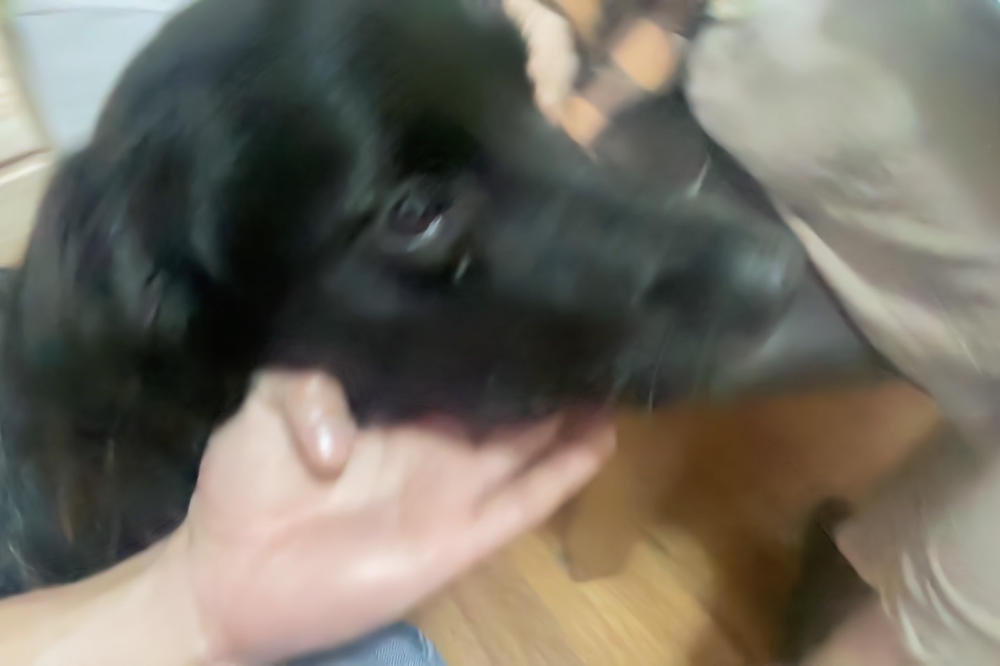

# CPS Sprint - Camera Testing
Today we connected Amanda's Raspberry Pi to a Raspberry Pi Camera Module 2. Bill was able to teach us how to use the Raspberry Pi, and provided the testing code from his Cybernetic Stream Table project.

## Camera Test
We cloned Bill's Cybernetic Stream Table git to the Raspberry Pi. We then used one of the camera test commands to ascertain whether the camera module works as intended.

### Test Code
tom@raspberrypi:~ $ cd cybernetic-stream-table/
tom@raspberrypi:~/cybernetic-stream-table $ cat ssh_commands.sh
tom@raspberrypi:~.cybernetic-stream-table $ libcamera-jpeg --qt-preview on -o test.jpg

### Test Outcome
[0:03:22.262966644] [2049]  INFO Camera camera_manager.cpp:284 libcamera v0.2.0+120-eb00c13d
[0:03:22.304937000] [2055]  WARN RPiSdn sdn.cpp:40 Using legacy SDN tuning - please consider moving SDN inside rpi.denoise
[0:03:22.306706070] [2055]  WARN RPI vc4.cpp:392 Mismatch between Unicam and CamHelper for embedded data usage!
[0:03:22.307315754] [2055]  INFO RPI vc4.cpp:446 Registered camera /base/soc/i2c0mux/i2c@1/imx219@10 to Unicam device /dev/media1 and ISP device /dev/media0
[0:03:22.307354289] [2055]  INFO RPI pipeline_base.cpp:1102 Using configuration file '/usr/share/libcamera/pipeline/rpi/vc4/rpi_apps.yaml'
Made QT preview window
Mode selection for 1640:1232:12:P
    SRGGB10_CSI2P,640x480/0 - Score: 4504.81
    SRGGB10_CSI2P,1640x1232/0 - Score: 1000
    SRGGB10_CSI2P,1920x1080/0 - Score: 1541.48
    SRGGB10_CSI2P,3280x2464/0 - Score: 1718
    SRGGB8,640x480/0 - Score: 5504.81
    SRGGB8,1640x1232/0 - Score: 2000
    SRGGB8,1920x1080/0 - Score: 2541.48
    SRGGB8,3280x2464/0 - Score: 2718
Stream configuration adjusted
[0:03:22.942957075] [2049]  INFO Camera camera.cpp:1183 configuring streams: (0) 1640x1232-YUV420 (1) 1640x1232-SBGGR10_CSI2P
[0:03:22.943377487] [2055]  INFO RPI vc4.cpp:621 Sensor: /base/soc/i2c0mux/i2c@1/imx219@10 - Selected sensor format: 1640x1232-SBGGR10_1X10 - Selected unicam format: 1640x1232-pBAA
Mode selection for 3280:2464:12:P
    SRGGB10_CSI2P,640x480/0 - Score: 10248.8
    SRGGB10_CSI2P,1640x1232/0 - Score: 6744
    SRGGB10_CSI2P,1920x1080/0 - Score: 6655.48
    SRGGB10_CSI2P,3280x2464/0 - Score: 1000
    SRGGB8,640x480/0 - Score: 11248.8
    SRGGB8,1640x1232/0 - Score: 7744
    SRGGB8,1920x1080/0 - Score: 7655.48
    SRGGB8,3280x2464/0 - Score: 2000
[0:03:28.074986497] [2049]  INFO Camera camera.cpp:1183 configuring streams: (0) 3280x2464-YUV420 (1) 3280x2464-SBGGR10_CSI2P
[0:03:28.078811422] [2055]  INFO RPI vc4.cpp:621 Sensor: /base/soc/i2c0mux/i2c@1/imx219@10 - Selected sensor format: 3280x2464-SBGGR10_1X10 - Selected unicam format: 3280x2464-pBAA
Still capture image received

PS Don't forget Bhuthu!!

