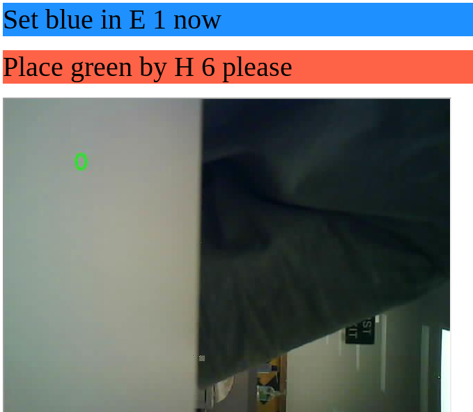

# Display Transcripts

This is a simple flask server that displays the transcripts generated by the audio transcription and lip reading models. I've also set it up to stream an image from the detector device.

## To do

 1. Make it so that a single event triggers both of the transcripts to update
 2. Make it so that the the txt files can be appended to but the python will just read the last 2 lines.
 3. Do a nicer design of the elements on the page and make it mobile friendly.
